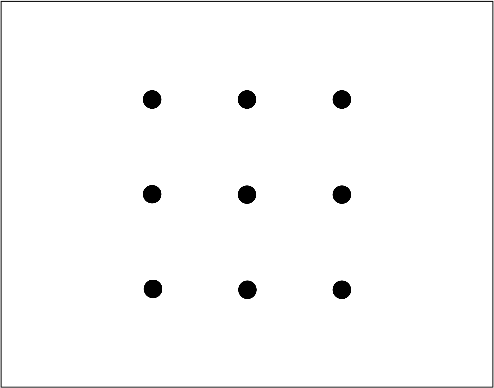
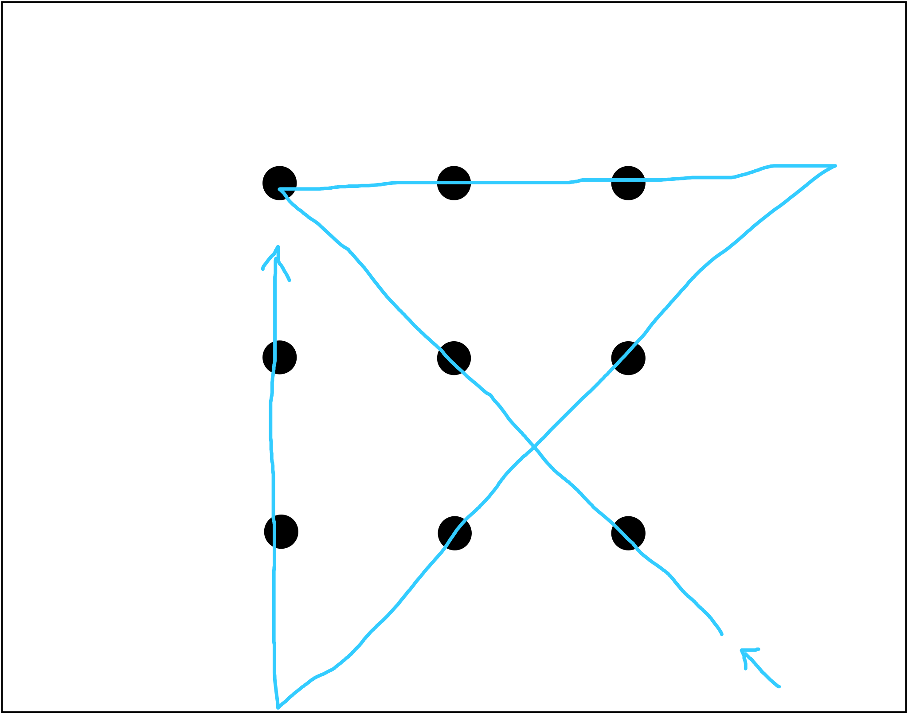
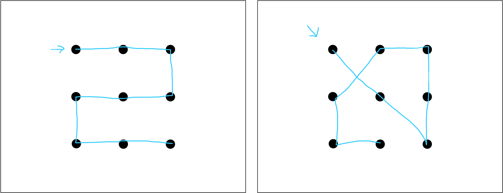

# Introduction: What Is AI? {#introduction}

```{marginfigure}
@barr1981handbook  p. 11.
```

> Physicists ask what kind of place this universe is and seek to characterize its behavior systematically.  Biologists ask what it means for a physical system to be living.  We in AI wonder what kind of information processing system can ask such questions.

## Cognitive self-experiment: The nine-dot puzzle

```{marginfigure}
Each chapter in this book will include one or more "cognitive self-experiments."  These are small experiments that can be done by any reader who is a human.  (;  
```                                                                                                            

```{marginfigure}
The point of these experiments is to give you a chance to get direct, first-hand experience with interesting ideas that turn out to be fundamentally important in AI.  
```

```{marginfigure}
A word of advice: **You will learn a lot more by actively doing these experiments** than by just passively reading through them.  Nothing can replace the valuable learning that happens when your brain is actively wrestling with a problem or activity.  
```

```{marginfigure}
Moreover, a lot of these experiments have "spoilers" at the end, and so if you just read through them without doing them, you may not ever be able to go back and recreate the experience.
```

We are going to kick off our adventures in intelligence by considering a very famous puzzle called the nine-dot puzzle.

::: {.exercise #ninedotpuzzle}
The nine-dot puzzle

*Materials needed:*

- *Paper*
- *Writing utensil (pencil, pen, marker, crayon, sharpened burnt stick, etc.)*
:::


```{r, echo = FALSE, out.width="50%", cache=TRUE, fig.alt="Nine black dots on a white background, with the dots arranged in a square three-by-three grid",fig.align = 'center'}

```

First, draw nine dots on your piece of paper, as shown above.

Now, your task is to draw a series of straight lines that will connect all nine dots.  The catch is that you can use no more than FOUR lines, and they must all be connected, i.e., you have to draw them WITHOUT picking up your pencil from the paper.

Ready?  Go!

Give yourself at least 5 minutes to work on this.

...

...

...

...

...


```{marginfigure}
In American culture, there is no more iconic "thinking sound" than [the music from the Jeopardy game show](https://archive.org/details/tvtunes_29826).  (If you are like me, there is also, ironically, no sound more guaranteed to completely disrupt your thinking processes!)
```

(Jeopardy music plays in background)

...

...

...

...

...


If you have never seen it before, the nine-dot puzzle is quite difficult, and can seem downright impossible.  Four straight lines?  WITHOUT picking up your pencil?  Inconceivable!

```{marginfigure}
@chronicle2001insight
```

If you find yourself struggling, don't worry, you are in good company.  In most research studies given to "naive" participants (i.e., people who have never seen this puzzle before), a whopping 0% of participants are able to solve it.  (The difficulty of this puzzle is the reason that it is such a classic!)
<!--In this 2001 review, the authors note that: "The highest solution rate reported for naive participants was 9.4% (Lung and Dominowski, 1985)."-->

```{marginfigure}
@macgregor2001information
```

For example, in one study, not a single one of 27 undergraduate students was able to solve this puzzle, even after ten separate attempts.

```{r, echo = FALSE} 
msmbstyle::solution(header = "Click here for a basic HINT.",
                    toggle = TRUE,
                    text = "Hint: Try thinking a little more outside the box....",)
```

```{r, echo = FALSE} 
msmbstyle::solution(header = "Click here for a more detailed HINT.",
                    toggle = TRUE,
                    text = "Hint: Try using line segments that start or end out in empty space, i.e., outside the \"square\" defined by the grid of nine dots.",)
```

```{r, echo = FALSE, results='asis',fig.alt="Solution to the nine-dot puzzle.  The first line segment starts at the bottom right dot and goes northwest, through the center dot and up to the top left dot.  The second line segment starts from there and goes east, through the top row of dots and a little ways past, into empty space.  The third line segment starts from there and goes southwest, hitting the right middle dot and the center bottom dot, and continuing past into empty space.  The fourth line segment starts from there and goes straight north, through the left column of dots, ending at the top left dot.",fig.align = 'center'} 
msmbstyle::solution_begin(header = "Click here to reveal the solution to the nine-dot puzzle.",
                    toggle = TRUE)

cat("The solution has been drawn below, with arrows to show the starting and ending points.  Of course, equivalent solutions exist in the form of rotations or reflections of this one.")

cat("  \n   \n  ")



msmbstyle::solution_end()
```

Once you have found it or seen it, the solution to the nine-dot puzzle can seem blindingly obvious.  But, getting there requires a kind of leap of intuition regarding where you believe your line segments can start and end.

```{marginfigure}
...which is why solving this puzzle is often wryly described as "thinking outside the box."
```

In particular, most people attempting the puzzle for the first time will assume that each of their line segments must start and end on a dot.  It takes significant creativity and cognitive flexibility to realize that line segments can stretch beyond the invisible "box" defined by the grid of dots.

The nine-dot puzzle is an example of what cognitive scientists call *insight problem solving*, as opposed to routine problem solving.  For example, doing long division involves routine problem solving, because if you know the steps, then it's just a matter of applying them (correctly) until you are done.  Insight problem solving, on the other hand, requires you to fundamentally rethink some aspect of the problem in order to solve it.

"This is all well and good," you might be thinking, "but what does the nine-dot puzzle have to do with AI?"  We are getting there!  But we first need to describe the problem using more precise terminology.

## A more precise description of the nine-dot puzzle

One way to describe the nine-dot puzzle is as a *search* problem: 

> Given all possible straight line segments going through some of the dots, find a contiguous set of four segments that connects all nine dots.

In your early attempts to solve the nine-dot puzzle, you might have tried out some different solutions like these:

```{r, echo = FALSE, out.width="100%", cache=TRUE, fig.alt="Two incorrect solutions to the nine-dot puzzle that use five and six line segments to connect all of the dots, respectively."}

```

In making these attempts, you were *searching* through a space of possible collections of line segments.  Using this terminology, we can describe what makes the problem so difficult:

> If possible line segments are restricted to those that start and end on a dot (call this **Search Space A**), then the correct answer is impossible to find, i.e., the correct answer is not contained within the space of possibilities being searched.

```{marginfigure}
A quick back-of-the-envelope calculation can tell us how many possibilities we are searching through, even using the (incorrectly) constrained Search Space A:
<br>
&nbsp;&nbsp;  --- &nbsp; Assume you start the first line segment at any one dot (out of 9); then your first segment ends at any other dot (out of 8 remaining); second segment ends at any other dot (out of 7); third segment ends at any other dot (out of 6); and finally the fourth segment ends at any other dot (out of 5).
<br>
&nbsp;&nbsp;   --- &nbsp; So, $9 \times 8 \times 7 \times 6 \times 5 = 15,120$ possible sets of four connected line segments, give or take.  This is a slight overestimate, as it includes line segments that might overlap or be continuations of the same line.
<br>
&nbsp;&nbsp;   --- &nbsp; However, this estimate should be sufficient to convince ourselves that this is indeed a sizable search space.  (This kind of rough estimate is common in AI, as we shall see throughout this book!)
```

Even if the search space is defined in this limited (and, it turns out, incorrect) way, the search space is still quite large.  In other words, there are many, many possible line segments that would fit under the terms of this incorrect definition of the problem, which is probably why people can spend such a long time trying all kinds of various (and inevitably incorrect) solutions, like the ones shown in the above figure.

We can also use this terminology to describe the magical leap of intuition that will allow finding the correct answer:

> In order to find the correct solution, the space of possible line segments must include those that start/end on one or more dots and end/start either on another dot or anywhere in the empty space outside the square defined by the nine dots (call this **Search Space B**).

We can observe that Search Space B is much bigger than Search Space A.  (In fact, A is a strict subset of B.  Moreover, A is finite, whereas B is infinite!)  Therefore, even knowing that you should be using Search Space B, you might have a lot of lollygagging around to do before finding the solution---and there are no guarantees that you even *will* be able to find the correct solution!  In particular: 

```{marginfigure}
It turns out these search properties---using an iterative, trial-and-error type of process; having to remember previous attempts; and trying to use some additional cleverness or insight to guide the search---are common to many AI techniques!  We will come back to these many times throughout this book.
```

- your process of searching will probably still involve a good deal of trial-and-error; 
- you have to remember your previous attempts so you don't keep repeating the same mistakes over and over; 
- there is still a need for some cleverness or insight on your part (or just blind luck!) to land on the correct solution.

All of these are characteristics of the *process* that you use to search within a given search space.  We can call this your *search algorithm*, where "algorithm" is just our fancy computer science term for a sequence of steps that you take.

So, putting it all together, we might describe a person's typical nine-dot puzzle experience as follows:

1. Assume Search Space A.
2. Spend some time fruitlessly searching through A.
3. Eventually, change to Search Space B.
4. Spend some time searching through B until the solution is found.

All four of these steps require intelligent effort, and these brief descriptions gloss over a lot of important details.  For example, when/why would someone decide to finally give up on Search Space A?  How might someone decide to try Search Space B (as opposed to other possible search spaces)?  Etc.

More generally, we can say that finding the correct solution to the nine-dot puzzle requires landing on the right search space AND having an effective search algorithm.

- If you don't have the right search space, it doesn't matter how good your search algorithm is; you will never find the correct answer.
- If you don't have a good search algorithm, it doesn't matter whether you are in the right search space; you are not likely to find the correct answer.

**It turns out that these basic principles about search spaces and search algorithms are EXACTLY what AI is all about!**

```{marginfigure}
Interestingly, finding the right search space and the right search algorithm for a given problem is still mostly the province of AI researchers.  In other words, it is mostly through *human* insight that we've managed to make AI techniques work for so many interesting problems.  We are still quite a long way from having AI systems that can really, truly look at a problem from scratch, and come up with their own search spaces and search algorithms to solve it.
```

Virtually all of AI is about trying to solve complex problems using various kinds of search algorithms.  However, like the nine-dot puzzle, it is more of an art than a science to figure out what the right search space is.  Then, for a given search space, it takes additional work to find the right kind of search algorithm, including figuring out specifics of the three search properties described above: iterative trial-and-error, remembering what you've already tried, and incorporating some kind of extra cleverness or insight to help the search along.

We will come back to these ideas shortly!  But first, we'll take a slight detour to start building the definition of AI that we will use throughout this book.


## What is artificial intelligence?  Part 1

Ah, the million dollar question, a.k.a., what are we all doing here on this AI learning adventure?

<!--There are probably as many definitions of AI as there are AI textbooks.  (Actually there are probably a lot more, if we count definitions in papers, popular science books, essays, etc.)  (The number of definitions of AI is probably exponential in the number of textbooks!)-->

It is easy to get bogged down in philosophical discussions when talking about what AI is, or isn't, or might someday be.  However, an accurate and pragmatic definition begins with observing that **AI is, first and foremost, a scientific discipline.**  You take courses in AI, there are AI textbooks and AI professors, and you can say, "I will use AI techniques to solve this particular problem."

Thus, you can think of AI in the same way that you think about other disciplines like chemistry, physics, math, or mechanical engineering.  AI is a particular field of human knowledge that has to do with studying certain kinds of problems and certain kinds of solutions to those problems.  (What kinds of problems and solutions we will get to shortly!)

The chemistry analogy is a useful one, because you probably already have some pretty good intuitions about chemistry (assuming you went through a traditional educational pathway that included chemistry in high school or college).  Here are some useful takeaways from this analogy:

- Chemists study both naturally occuring chemical reactions as well as artificial ones created in the lab.  Similarly, AI people study both naturally occurring intelligences (e.g., people, animals) as well as artificial systems created in the lab.
- There are many subfields and offshoots of chemistry (e.g., environmental chemistry, materials science, biochem, etc.).  Similarly, there are many subfields and offshoots of AI (e.g., computer vision, machine learning, robotics, etc.).
- Chemists have created new things that have been both very good and very bad for society, often at the same time (e.g., plastic).  Similarly, AI people have created new things that have been both very good and very bad for society (e.g., online behavior tracking and prediction).

One source of confusion regarding definitions of AI is that people often use the term AI to refer to the scientific discipline as well as the objects of study, e.g., "She built an AI to solve the problem."  In chemistry, people usually use different terms for the discipline versus the objects of study, e.g., "He developed a chemical reaction," or "She created a new chemical," or "They discovered an interesting substance."

And of course, increasing the confusion further are the values that people often attach onto the term AI, for instance implications that every AI system is somehow sentient or eerily similar to humans in some magical way.

AI is not magic, any more than chemistry is.  (Although, just as in chemistry, we can do some very cool things with AI techniques and systems!)  An "AI" is not somehow magically intelligent just because we call it that, any more than a combustion reaction in the lab is the same as a wildfire just because we call it a "fire."  (Although, just as we can learn valuable new things about wildfires by studying combustion reactions in the lab, certainly we can learn valuable new things about human intelligence by building and studying AI systems in the lab.)

Following this observation that AI is a scientific discipline like chemistry, for the rest of this book, we will use the term "AI" either as a noun to refer to the discipline, or as an adjective to refer to some object of study, e.g., AI technique, AI system, AI person, etc.


## What is artificial intelligence?  Part 2

So, given that AI is a scientific discipline...what *is* AI the study of, exactly?  In this book, we will use the following definition:

```{marginfigure}
Notice that we did NOT use the word \"intelligence\" anywhere in this definition!  (There are a lot of circular definitions of AI that say something like, \"AI is the study of computational systems that emulate human intelligence,\" which is not very helpful when we are trying to pin things down more precisely.)
```

::: {.customdefinition #ai}
**Definition 1** &nbsp; **Artificial intelligence (AI)** is the scientific study of computational systems that use knowledge representations and search algorithms to solve complex problems.
:::

There are six key elements of this definition that bear further scrutiny, and we address them in reverse order.

### What is a problem?

::: {.definition #problem}
&nbsp; A **problem** is any kind of situation that requires a particular response, i.e., an input-output pairing where only certain outputs are considered to be valid or correct.
:::

Under this very broad definition, the nine-dot puzzle is a problem, and so is walking down the street.  The question, "What is 2+2?" is a problem, and so is behaving properly at a job interview. 

 For some problems, like the nine-dot puzzle, there may be a clearly defined correct solution.  Other problems, like walking down the street, admit to many (possibly infinite) solutions that might all be equally valid, but that differ in their details.

### What is a complex problem?

::: {.definition #complexproblem}
A **complex problem** is a problem for which there are many, many possibilities to consider along the way to finding a correct response.
:::

Note that this AI definition of complexity is a bit different from the notion of complexity from algorithms and complexity theory.  In the study of algorithms, a problem is complex if it requires lots of resources to solve (i.e., time and/or memory).  If a problem is complex under our AI definition, it will also be complex under the algorithms definition, but not vice versa.

For example, trying to find a needle in a haystack is a complex problem under both definitions: there are many possibilities to consider, AND it will take a long time to go through each piece of hay.  However, suppose we are just trying to count how many pieces of hay there are.  This is still complex under the algorithms definition (in particular, it would take $O(n)$ in time, for $n$ pieces of hay), but it is not complex under our AI definition, because there aren't really multiple possibilities of anything to consider along the way.

Under our AI definition of complexity, we can observe that the nine-dot puzzle is indeed a complex problem, because there are many possible sets of line segments that can be considered along the way to finding the correct solution.

### What is a search algorithm?

::: {.definition #searchalgorithm}
A **search algorithm** is a sequence of logical steps for sifting through a large number of entities to find one or more entities that meet certain target criteria.
:::

How convenient!  We are faced with complex problems, that require considering a lot of things, and we can use search algorithms, which are specifically intended for looking through a bunch of things!

Of course, effective searching is easier said than done.

Many problems tackled in AI are so complex that even if you spent the entire lifetime of the universe searching blindly, without a good algorithm, you would not ever be likely to stumble onto the correct answer.  Thus, much of the work done by AI people has been coming up with new and exciting ways to search, often specialized for a particular type of problem.

Things that can make AI search algorithms more effective include many commonsense improvements that would apply equally well to searching for your car keys in the morning, for example:

- Remembering where you have been, so you don't visit the same spots twice.
- Strategically picking "good" parts of the search space to search in.
- Strategically avoiding "bad" parts of the search space that you might otherwise get stuck in.
- Using known information about the problem in clever ways to better guide the search.
- And more!

We will see many, many examples of these kinds of effective search algorithms throughout this book.

```{marginfigure}
In addition to helping you learn the fundamentals of AI, this textbook will also highlight examples of the kinds of things that AI people do, especially things that require human creativity and diverse forms of thinking.  See below for more on [different kinds of AI people](#aipeople).
```
Oftentimes, a particular search algorithm will be designed to capture a simple intuition like those in the above list, and what AI people use their expertise for is figuring out how to implement the intuition in concrete mathematical and computational terms.  It takes creativity to come up with the right intuition for a problem in the first place, and it also takes creativity to figure out how to translate the intuition into an actual algorithm.

### What is a knowledge representation?

::: {.definition #knowledgerepresentation}
A **knowledge representation** is a structured collection of symbols that stand for some conceptual entity.
:::

```{marginfigure}
If you have some familiarity with different sub-areas within AI, you might be thinking, "Wait a minute!  I thought knowledge representations are only used in knowledge-based AI or expert systems, but other parts of AI, like machine learning, are all about making AI systems that don't NEED outside knowledge."
<br><br>
Not quite!
<br><br>
It is true that certain specialized areas of AI focus on using certain types of hand-engineered knowledge bases.  However, it is *not* true that other parts of AI don't use knowledge representations at all!  The knowledge representations are just of a different sort.
<br><br>
By analogy, consider how *molecular biology* is one specific sub-area of biology, but molecules play a critical role in all kinds of biology.  All biologists know about molecules, and could probably tell you how and why molecules are important in their particular field of study.  Molecular biology just happens to focus on certain kinds of biological problems and experimental methods at the molecular level.
<br><br>
Knowledge representations are just as ubiquitous in AI as molecules are in biology!
```

Knowledge representations are how a problem gets presented to the intelligent agent trying to solve it.  For example, we can identify a few layers of knowledge representation in the nine-dot puzzle:

- First, there is the visual image of nine dots on a piece of paper.  If you have a typical human visual system, then your eyes and brain are able to process the light and dark patterns on the page to form a visual impression of the nine dots.
- Next, when you read the instructions, you probably form some internal mental representation of what the goal of the problem is: connect all of the dots using no more than four straight line segments.  You have a lot of existing knowledge that allows you to translate these words into some kind of visuospatial equivalents.  For example, you know what connecting dots with a line should look like; you know what is meant by "all of the dots;" you know what straight lines are; you know what connected straight lines are; and you know what the number four means.
- You probably also have some idea of the possible actions that you can take, e.g., drawing a line segment onto the paper.
- As discussed above, you also probably form some internal mental representation of what you think the search space is (e.g., Search Space A, the set of all line segments starting and ending on a dot).


### What is a computational system?

::: {.definition #computationalsystem}
A **computational system** is ....
:::

Examples, etc.


## AI as a scientific discipline

There is a sixth term in our AI definition that we didn't yet define, and that is the "scientific study" part.  What does it mean to study something scientifically?

```{marginfigure}
The scientific study of science itself (!) falls under the fascinating discipline of *philosophy of science*.
<br><br>
One of the most amazing bits of luck I had in my education was having Nancy Nersessian, a world-renowned philosopher of science, working two doors down from my PhD advisor's office in graduate school.  Nancy's research centers on understanding the cognitive processes by which scientists make new discoveries, which, if you think about it, is an incredible demonstration of our species' creative powers.  Her classes and writings completely changed the way I think about science and creativity.
<br><br>
This book is an excellent primer:
@nersessian2008creating
<br><br>
Getting AI sytems to demonstrate this level of creative intelligence remains an aspirational goal, though there have been attempts!  For more, see the chapter on [Creativity](#creativity).
```

You may be familiar with definitions of science that revolve around using the scientific method:  coming up with hypotheses, making predictions, and then doing experiments to test those predictions.   While this rather strict definition does describe some scientific doings, real-world science has always been, and continues to be, much more diverse in how it progresses.  Real science involves storytelling, accidents, influences of contemporary politics and culture and economics and technology, collaboration, competition, thought experiments, drawings, field trips, mistakes, arguments, and all sorts of other messy and interesting human activities.

While all sciences share these kinds of activities, there are certain "flavors" of science that lend themselves more to certain systematic methods of study.  Three of the most common flavors are:

1. Mathematics
2. Engineering
3. Empirical science


AI (and really computer science more broadly) is a very interesting sort of science because it combines aspects of three distinct *types* of scientific fields:  mathematics, engineering, and 

where does knowledge come from

math, engineering, empirical science

Newell and Simon.

etc.


## Different kinds of AI <=> Different kinds of AI people {#aipeople}

While you might imagine that all AI people are number-crunching, code-writing geeks, there are actually lots of different kinds of contributions that are valuable in AI, and we really need lots of different kinds of people to contribute!

## Rest of the chapter stuffs

For now, suffice it to say that virtually every AI technique can be broken down in these terms.  (For instance, when encountering any new AI technique, it can be a useful exercise to ask: "What are the representations?" and "Where is the search?" and "How hard is the search?"---i.e., questions that map onto these three elements.)

```{marginfigure}
For alternative definitions, see ["What exactly IS AI?"](https://plato.stanford.edu/entries/artificial-intelligence/#WhatExacAI) in the excellent AI overview written by  Selmer Bringsjord and Naveen Sundar Govindarajulu in the Stanford Encyclopedia of Philosophy (SEP).
```

```{marginfigure}
(I find [SEP](https://plato.stanford.edu/index.html) to be an indispensable resource for learning about big ideas in many areas of AI, cognitive science, math, and of course philosophy.)
```

Unlike other definitions of AI, this definition puts many kinds of intelligence on equal footing in terms of how we can study them, and also in terms of which ones fall under the purview of AI to study: human intelligence, machine intelligence, non-human animal intelligence.  Hypothetical alien intelligence.  Babies, adults, the elderly.  Neurotypical people, neurodiverse people.  Intelligence that is rational and/or irrational.  Intelligence that is mathematical, physical, linguistic, visual, spatial, social, emotional, and/or cultural.  AI for robots, AI for interactive systems...and so on.

I find it all equally fascinating, and we will consider examples of all of these kinds of intelligence throughout this book.


<being a cognitive scientist means having a subject to study all the time!>

<computational perspective.  humans and other animals are an existence proof of what is possible.>

## Examples of problems that AI can solve {-}

<Under construction.>


## Why triangles? {#triangle -}

```{marginfigure}
@kunda2021ai
```

The name of this book comes from an idea I recently had about the different kinds of knowledge that are necessary for understanding AI:

- *Computational knowledge* about code, how pieces of code run, what data structures are and how they behave, etc.
- *Conceptual knowledge* about abstract ideas like infinite search spaces; graphs, nodes, and edges; trees and branches; high-dimensional surfaces; infinite time horizons; etc.
- *Mathematical knowledge* about formal mathematical entities like functions, sets, variables, equations, etc.

These three kinds of knowledge form what I call the "AI triplet."  Expertise in AI often requires being able to think about the same concept at each of these three levels, both separately and in combination.

You can see an illustration of the AI triplet here:

```{r, echo = FALSE}
knitr::include_graphics('images/ai_triplet.png')
```

```{marginfigure}
@johnstone1982macro
```

This idea was inspired by the "chemistry triplet," a similar triad for chemistry that was originally proposed in 1982, and that has been very influential in chemistry education.  

In chemistry, as shown below, there is a submicroscopic level that consists of particles and waves and so on.  Interactions at this level *generate* phenomena at the macroscopic level, which includes human-scale things like solids and liquids and different substances.  Then, there is a symbolic level that contains all the human-created notation to *describe* things at the other two levels.

```{r, echo = FALSE}
knitr::include_graphics('images/chemistry_triplet.png')
```

Levels of knowledge in AI are both similar to and slightly different from those in chemistry.  In chemistry, just as things at the submicroscopic level generate things at the macroscopic level, so too in AI, things at the computational level generate things at the conceptual level.  

In other words, pieces of code in the computational artifacts that we build are a bit like particles in a chemical system.  They interact and undergo various behaviors and changes, often in complicated ways that we cannot predict from the starting state of the system.  Eventually, just as particles interact to produce what we call a liquid, the pieces of code in AI systems interact to produce conceptual behaviors like searching through a space of possibilities.  These conceptual behaviors are eventually combined to produce chess-playing systems, car-driving systems, image recognition systems, and so on---all of the AI capabilities that are comprehensible to us at human scales.

And, finally, just as notation in chemistry is a human-created construct that is useful for describing and modeling chemical systems, in AI, we use math as a formal construct for describing (or designing) things that are happening in our AI systems.  Sometimes math shows up in the form of equations and calculations, and sometimes just in the style of formal notation that we use to describe AI problems or elements in an AI system.

Throughout this book, new topics and ideas will generally be introduced at the conceptual level, and then we will add discussion of what is happening at computational and mathematical levels.  


```{r, fig.margin = TRUE, echo = FALSE, out.width="40%", cache=TRUE}
knitr::include_graphics("images/triangle-both.png")
```

When making the switch into computational- (C) or mathematical-land (M), we will use these triangle symbols to help signal the shift.  Eventually, you will be able to more easily jump around the various levels when thinking about a given AI topic.


## Cognitive experiments {-}

<Under construction.  Do them!>

An ecological view of intelligence.

Compare: Take a simple robot, and add this cool capability.  Versus, take this cool capability in humans, and simplify it enough to express it computationally.  The second approach will help you to explicitly think about the gaps between an AI technique and human intelligence.


## In this book: How terminology is used {-}

<Under construction.>

Feynman quote.


## In this book: Exercises {-}

<Under construction.  Do them!>


## Other resources {#sec:resources -}

To conclude this introduction, here are some general recommendations for other AI-related resources:

- Melanie Mitchell's very recent book [*Artificial Intelligence: A Guide for Thinking Humans*](https://melaniemitchell.me/aibook/) gives a non-technical but content-rich overview of the broad field of AI, where it has been and where it is going, and descriptions of major approaches.

- For more in-depth information about many of the AI topics covered in this book, [*Artificial Intelligence: A Modern Approach*](http://aima.cs.berkeley.edu/) by Stuart Russell and Peter Norvig (often called "AIMA" or "Russell & Norvig") continues to be a standard in the field.  I still regularly use my old, dark-green, second-edition copy as a desk reference.  In addition to the coverage of technical topics, there is a really fabulous "Bibliographical and Historical Notes" section at the end of each chapter that lays out how the major developments in each area unfolded over time.

- <Under construction: Add Poole & Mackworth.>

- UC Berkeley graciously shares many materials from their undergraduate AI course [*CS 188*](https://inst.eecs.berkeley.edu/~cs188/sp21/), including lecture slides, homework problems, and the widely used [Pacman AI Projects](https://inst.eecs.berkeley.edu/~cs188/sp21/projects/).  Their treatment of topics tends to follow Russell & Norvig.

- [*Mind Design II*](http://cognet.mit.edu/book/mind-design-ii), edited by John Haugeland.  Reading this book was one of the most influential intellectual journeys I ever took. Starting with Turing’s classic paper on "Computing Machinery and Intelligence," going through key ideas from thinkers like Newell & Simon, Dennett, Minsky, and Searle (the famous Chinese room argument), on to Rumelhart’s visions of connectionist representations, and so forth. (You can also find many of the individual papers from this collection online, in their original published form.  This book contains edited versions of the originals.)

- For more on machine learning, Tom Mitchell's [*Machine Learning*](http://www.cs.cmu.edu/~tom/mlbook.html) textbook gives an excellent and digestible overview of major approaches and also theoretical angles.  (Do not be put off by the 1997 publication date!  The fundamentals abide.)

- For more on neural networks , I recommend Michael Nielsen's [*Neural Networks and Deep Learning*](http://neuralnetworksanddeeplearning.com/), which provides a superb introduction, and [*Deep Learning*](https://www.deeplearningbook.org/), by Ian Goodfellow, Yoshua Bengio, and Aaron Courville, for more advanced topics.

- For more on reinforcement learning, Richard Sutton and Andrew Barto's [*Reinforcement Learning: An Introduction*](http://incompleteideas.net/book/the-book.html) is another standard in the field.

- <Under construction: Add The Life of Cognitive Science.>

## Why textbooks are a good choice for learning AI {-}

<Under construction.>
