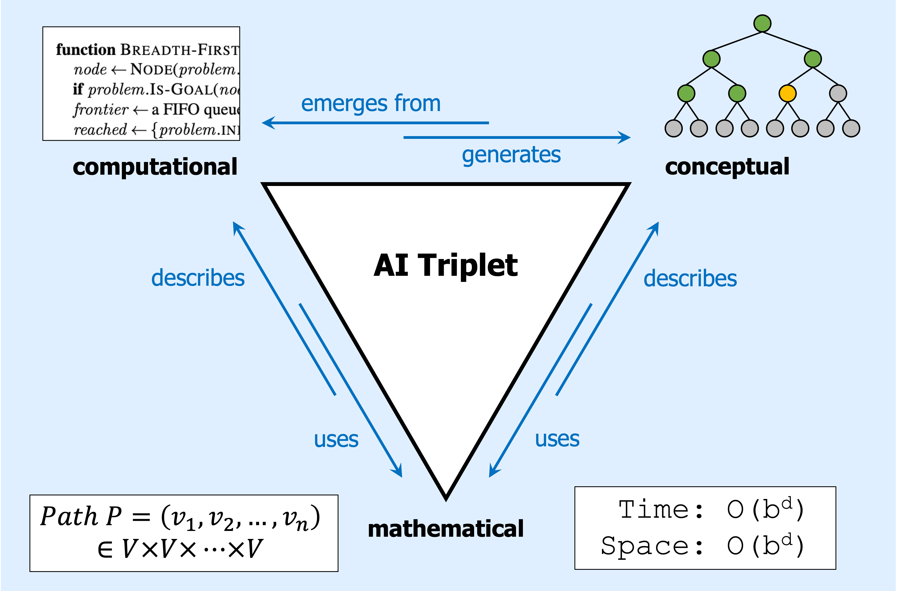
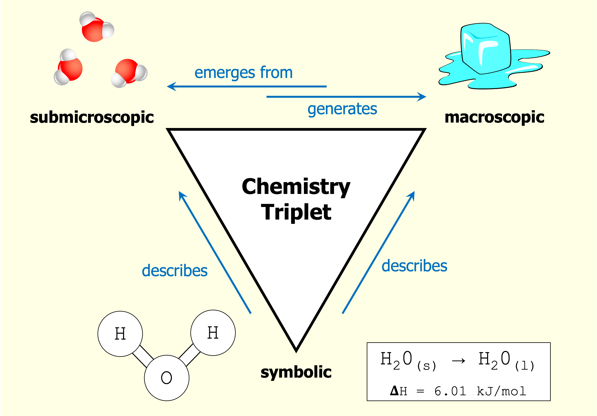

# Introduction {#introduction}


## What is artificial intelligence?

There are probably as many definitions of AI as there are AI textbooks.  (Actually there are probably a lot more, if we count definitions in papers, popular science books, essays, etc.)  (The number of definitions of AI is probably exponential in the number of textbooks!)

In this book, I propose the following definition:

> AI is the study of how knowledge representations and search algorithms can be used to solve 
complex problems.

Later on, we will contemplate the three elements of this definition: 

- knowledge representations

- search algorithms

- complex problems 

For now, suffice it to say that virtually every AI technique can be broken down in these terms.  (For instance, when encountering any new AI technique, it can be a useful exercise to ask: "What are the representations?" and "Where is the search?" and "How hard is the search?"---i.e., questions that map onto these three elements.)

```{marginfigure}
For alternative definitions, see ["What exactly IS AI?"](https://plato.stanford.edu/entries/artificial-intelligence/#WhatExacAI) in the excellent AI overview written by  Selmer Bringsjord and Naveen Sundar Govindarajulu in the Stanford Encyclopedia of Philosophy (SEP).
```

```{marginfigure}
(I find [SEP](https://plato.stanford.edu/index.html) to be an indispensable resource for learning about big ideas in many areas of AI, cognitive science, math, and of course philosophy.)
```

Unlike other definitions of AI, this definition puts many kinds of intelligence on equal footing in terms of how we can study them, and also in terms of which ones fall under the purview of AI to study: human intelligence, machine intelligence, non-human animal intelligence.  Hypothetical alien intelligence.  Babies, adults, the elderly.  Neurotypical people, neurodiverse people.  Intelligence that is rational and/or irrational.  Intelligence that is mathematical, physical, linguistic, visual, spatial, social, emotional, and/or cultural.  AI for robots, AI for interactive systems...and so on.

I find it all equally fascinating, and we will consider examples of all of these kinds of intelligence throughout this book.


## Why triangles? {#triangle}

```{marginfigure}
Kunda, M. (under review). The AI Triplet: Computational, Conceptual, and Mathematical Representations in AI Education.
```

The name of this book comes from an idea I recently had about the different kinds of knowledge that are necessary for understanding AI:

- *Computational knowledge* about code, how pieces of code run, what data structures are and how they behave, etc.
- *Conceptual knowledge* about abstract ideas like infinite search spaces; graphs, nodes, and edges; trees and branches; high-dimensional surfaces; infinite time horizons; etc.
- *Mathematical knowledge* about formal mathematical entities like functions, sets, variables, equations, etc.

These three kinds of knowledge form what I call the "AI triplet."  Expertise in AI often requires being able to think about the same concept at each of these three levels, both separately and in combination.

You can see an illustration of the AI triplet here:

```{r, echo = FALSE}

```

```{marginfigure}
@johnstone1982macro
```

This idea was inspired by the "chemistry triplet," a similar triad for chemistry that was originally proposed in 1982, and that has been very influential in chemistry education.  

In chemistry, as shown below, there is a submicroscopic level that consists of particles and waves and so on.  Interactions at this level *generate* phenomena at the macroscopic level, which includes human-scale things like solids and liquids and different substances.  Then, there is a symbolic level that contains all the human-created notation to *describe* things at the other two levels.

```{r, echo = FALSE}

```

Levels of knowledge in AI are both similar to and slightly different from those in chemistry.  In chemistry, just as things at the submicroscopic level generate things at the macroscopic level, so too in AI, things at the computational level generate things at the conceptual level.  

In other words, pieces of code in the computational artifacts that we build are a bit like particles in a chemical system.  They interact and undergo various behaviors and changes, often in complicated ways that we cannot predict from the starting state of the system.  Eventually, just as particles interact to produce what we call a liquid, the pieces of code in AI systems interact to produce conceptual behaviors like searching through a space of possibilities.  These conceptual behaviors are eventually combined to produce chess-playing systems, car-driving systems, image recognition systems, and so on---all of the AI capabilities that are comprehensible to us at human scales.

And, finally, just as notation in chemistry is a human-created construct that is useful for describing and modeling chemical systems, in AI, we use math as a formal construct for describing (or designing) things that are happening in our AI systems.  Sometimes math shows up in the form of equations and calculations, and sometimes just in the style of formal notation that we use to describe AI problems or elements in an AI system.

Throughout this book, new topics and ideas will generally be introduced at the conceptual level, and then we will add discussion of what is happening at computational and mathematical levels.  


```{r, fig.margin = TRUE, echo = FALSE, out.width="40%", cache=TRUE}

```

When making the switch into computational- (C) or mathematical-land (M), we will use these triangle symbols to help signal the shift.  Eventually, you will be able to more easily jump around the various levels when thinking about a given AI topic.


## In this book: How terminology is used

<Under construction.  Start with Feynman quote.>


## In this book: Cognitive experiments

<Under construction.  Do them!>


## In this book: Exercises

<Under construction.  Do them!>


## AI & society

As I sit here drafting this particular subsection (June 2021), here are three recent headlines that caught my eye:

- "If Facial Recognition Is Not Regulated Now, It Will Never Be Used Responsibly"  [(Washington Post editorial)](https://www.washingtonpost.com/opinions/if-facial-recognition-is-not-regulated-now-it-will-never-be-used-responsibly/2021/06/02/e594d0f4-ba59-11eb-a6b1-81296da0339b_story.html)

- "Runaway Recommendation Engine"  [(Planet Money podcast)](https://www.npr.org/2021/05/26/1000529597/runaway-recommendation-engine)

- "Selfies, Surgeries and Self-Loathing: Inside the Facetune Epidemic"  [(Huffington Post article)](https://www.huffpost.com/entry/facetune-selfies-surgeries-body-dysmorphia_n_60926a11e4b0b9042d989d48)

```{marginfigure}
<Under construction: Quote from Soul of a New Machine.>
```

There is a lot of discussion nowadays about the harms caused by AI, which include harms to children; harms to the elderly; harms to politics and governments; harms to minority groups of various racial, ethnic, gender, socioeconomic, religious, or cultural backgrounds; harms to equality and justice; harms to our jobs and economies; harms to humans as well as the non-human species with whom we share our planet; etc.  It's a pretty alarming list.

Of course, we can also talk about how AI can *solve* problems in all of these areas, and there are many kind and intelligent AI experts all over the world working to do just that.

But, I rather suspect that AI is always going to be a very dangerous and bloody double-edged sword.

One way to think about the power of AI is that it can greatly magnify the actions of a single person.  Trying to find a good flight from Accra to Montreal?  One could slowly page through schedules of flights, or use a search algorithm that searches thousands of possible flight combinations every second.  Trying to create a CGI orc for the Hobbit movies?  One could manually design and animate an individual orc, or use simulation algorithms to generate an orc army.

In such fashion, AI can magnify human actions taken for good, like improving cancer treatments or monitoring earthquakes, but it can also magnify human actions taken out of ignorance, greed, or evil.  Hence: double-edged sword.

Or, perhaps a better analogy is the old classic of Pandora's box.  As with nuclear weapons (one of the other Pandora's boxes of our modern era), I don't think there is any way to put AI back in the box.  Its tendrils are continuing to spread into all aspects of our lives, for better and for worse.


```{marginfigure}
Except: this book will cover one particular slice of the pie, as described below in [This is your brain on AI](#sec:yourbrainonai).
```

There is far too much going on in terms of AI and society to cover within the pages of this book, and so I'm not even going to try to provide any kind of comprehensive treatment of these topics.  But, no AI education today is complete without thinking and learning about these issues.  Just as doctors and lawyers are expected to learn about, follow, and stay up-to-date on professional ethics and emerging societal issues related to their work, so too do we, as AI people, need to stay abreast of what is going on in the wider world related to AI.

If you are not getting this kind of material in your classes (or even if you are), there are many good books, documentaries, and even sci-fi and other fictional stories, novels, and TV shows that explore many of the really thorny questions.

One concrete suggestion:  Search online for "AI ethics course reading list," and you can find many university-based websites where professors have posted reading lists for their AI & ethics courses.  These are excellent resources.  

Here is a pseudo-random sampling:

- Harvard reading list on [Ethics and Governance of AI](https://cyber.harvard.edu/ethics-and-governance-ai-reading-list), by the Berkman Klein Center for Internet and Society.

- Hong Kong University of Science and Technology seminar on [Introduction to Ethical & Fairness Issues in AI](https://www.cse.ust.hk/~golin/Talks/Ethics_in_AI_Reading_List.html).

- Stanford course on [CS122: Artificial Intelligence - Philosophy, Ethics, and Impact](https://web.stanford.edu/class/cs122/).

- Vanderbilt course on [The Ethics of Artificial Intelligence](https://my.vanderbilt.edu/aiethics/schedule/).


## No more simple happy nerds

Like the nuclear scientists (probably like scientists of many stripes over the millennia), I really don't know what to do sometimes.  As an AI scientist, do I keep researching and teaching about AI things, even though they are actively, right now, today being misused?  Do I just stop?  Do I quit my job as a professor and become an investigative journalist, or a political activist?

```{marginfigure}
@su2021affective
```

There was a 2021 paper at CVPR, one of the premier computer vision conferences, that looked at how people in machine learning and computer vision (two big subfields of AI) feel about how these areas have been changing in recent years.  One quote in particular stuck out to me:

> As computer vision’s reach in our everyday lives expands, stories spoke of a growing realization among researchers that they could no longer be a "simple happy nerd pushing boundaries on the next cool computer vision technology," or "pretend to be an ostrich researcher hiding my head in the sand and blame others for the misuse of technology."

I think that we all have to choose what to do with our AI knowledge, and it has to be an active choice.  Gone are the days when we might have been "simple happy nerds," working on AI things that were theoretically interesting but might have had little impact on other people.

And, let me exhort each and every one of you who reads these words:  **As a computer science person learning about AI, you are going to know far more about how AI things work than the vast majority of other people on the planet.**  And, recalling the famous directive given to Spiderman by Uncle Ben, "With great power comes great responsibility."

*You* are the people we need to keep things from going completely off the rails, and to help guide our species' uses of AI more towards the good and away from the bad.  *You* are the people we need to help educate the rest of the public, to do investigations to find out how AI is being used, to be the brakes when others around you suggest bad ideas, to be the whistleblowers when you see others acting on their bad ideas, to come up with new laws to help protect people, and to start nonprofit foundations in the public interest.  

It can also be as simple as telling your friends and family members about how their online shopping data is getting used, and why they need to be careful about reading certain kinds of social media content.  Or it can be as involved as pursuing a PhD in order to become a world expert on how AI can affect elections, or whatever the issue is that captures your intellectual and emotional interests.

And, no matter what path you take, I think we also all have a responsibility, as computer scientists and AI people, to stay informed about what is going on with AI in the broader world.  The AI techniques we have at our fingertips are changing lightning-fast, and the resulting issues facing humanity are changing even faster.

Stay informed, and be brave.


## In this book: This is your brain on AI {#sec:yourbrainonai}

I was re-reading *Dune* recently and was very much struck by this passage:

> “Once men turned their thinking over to machines in the hope that this would set them free. But that only permitted other men with machines to enslave them.”

<Under construction.>


## Other resources {#sec:resources}

To conclude this introduction, here are some general recommendations for other AI-related resources:

- Melanie Mitchell's [*Artificial Intelligence: A Guide for Thinking Humans*](https://melaniemitchell.me/aibook/) gives a non-technical but content-rich overview of the broad field of AI, where it has been and where it is going, and descriptions of major approaches.

- For more in-depth information about many of the AI topics covered in this book, [*Artificial Intelligence: A Modern Approach*](http://aima.cs.berkeley.edu/), by Stuart Russell and Peter Norvig (often called "AIMA" or "Russell & Norvig"), continues to be a standard in the field.  I still regularly use my old, dark-green, second-edition copy as a desk reference.  In addition to the coverage of technical topics, there is a really fabulous "Bibliographical and Historical Notes" section at the end of each chapter that lays out how the major developments in each area unfolded over time.

- UC Berkeley graciously shares many materials from their undergraduate AI course [*CS 188*](https://inst.eecs.berkeley.edu/~cs188/sp21/), including lecture slides, homework problems, and the widely used [Pacman AI Projects](https://inst.eecs.berkeley.edu/~cs188/sp21/projects/).  Their treatment of topics tends to follow Russell & Norvig.

- [*Mind Design II*](http://cognet.mit.edu/book/mind-design-ii), edited by John Haugeland.  Reading this book was one of the most influential intellectual journeys I ever took. Starting with Turing’s classic paper on "Computing Machinery and Intelligence," going through key ideas from thinkers like Newell & Simon, Dennett, Minsky, and Searle (the famous Chinese room argument), on to Rumelhart’s visions of connectionist representations, and so forth. (You can also find many of the individual papers from this collection online, in their original published form.  This book contains edited versions of the originals.)

- For more on machine learning, Tom Mitchell's [*Machine Learning*](http://www.cs.cmu.edu/~tom/mlbook.html) textbook gives an excellent and digestible overview of major approaches and also theoretical angles.  (Do not be put off by the 1997 publication date!  The fundamentals remain.)

- For more on neural networks , I recommend Michael Nielsen's [*Neural Networks and Deep Learning*](http://neuralnetworksanddeeplearning.com/), which provides a superb introduction, and [*Deep Learning*](https://www.deeplearningbook.org/), by Ian Goodfellow, Yoshua Bengio, and Aaron Courville, for more advanced topics.

- For more on reinforcement learning, Richard Sutton and Andrew Barto's [*Reinforcement Learning: An Introduction*](http://incompleteideas.net/book/the-book.html) is another standard in the field.

- <Under construction: Add The Life of Cognitive Science.>


## References
