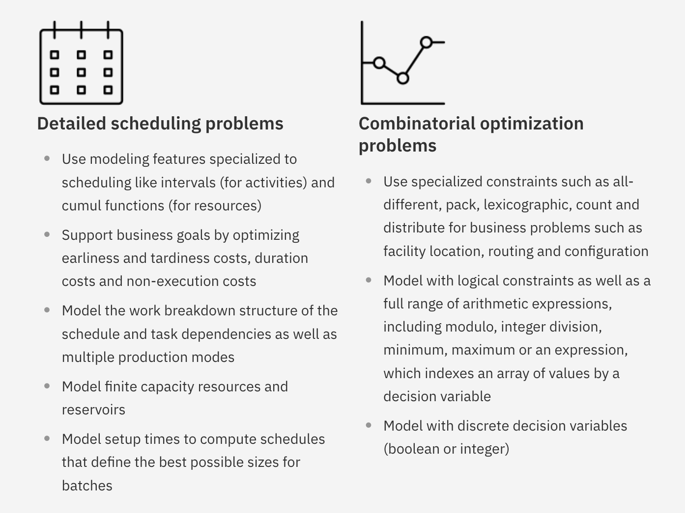

# Constraint Satisfaction

<Under construction. Add chapter intro.>

## Cognitive experiment: Something


## CSP solving in the real world

CSP solvers are already deeply embedded into modern industrial workflows (and have been for quite some time!).  There are many real-world problems that can be expressed as formal CSPs, and the answers generated by CSP solvers can be directly implemented onto factory floors, computer system scheduling, etc.

```{marginfigure}
List of CP systems from @lagerkvist2015constraint
```

Some companies make proprietary CSP solvers, a.k.a. "constraint programming" (CP) systems, as a tool to sell to other companies, such as:

- IBM's [CP Optimizer](https://www.ibm.com/analytics/cplex-cp-optimizer)
- Fico's [Xpress Kalis](https://www.fico.com/fico-xpress-optimization/docs/latest/solver/kalis/kalis_ug/dhtml/kalisugintro.html)  (Yes, the same Fico as FICO credit scores---they do a lot of things!)
- Opturion's CPX
- Sicstus Prolog

There are also many open source CP systems like:

- Gecode
- Choco
- OscaR
- Google or-tools
- Minion
- Jacop

There are also companies that specialize in CP services for particular industries.  For example, the small Swedish company [Tomologic](https://www.tomologic.com/) specializes in optimization and CP for the sheet metal industry.  From their website:

> Tomologic takes end-to-end control over the optimization process, from part placements in clusters to cutting path optimization. Maintaining reliable production implies taking into account all physical constraints in the cutting process, such as: heat, tension, melting, tilting parts, inductive cutting, struggling sheets etc. All these factors are part of our optimization model making it computationally intensive and requiring high performance computing.

Let's take a closer look at IBM's CP Optimizer to see how it works.  From their website:

```{r, fig.margin = FALSE, echo = FALSE, out.width="75%", cache=TRUE}

```

```{marginfigure}
@laborie2018ibm
```

From the paper:

"It is clearly not possible to provide an exhaustive description of all industrial applications that are using CP Optimizer. Nevertheless, if we focus only on recent articles published in the last 18 months, we can get an idea of the diversity of scheduling problems successfully addressed by CP Optimizer. These problems cover several domains:

- Manufacturing is of course an important area of application, both for discrete scheduling, for instance in the context of semiconductor manufacturing [18], or for disjunctive resource sequencing [14].
- Computer and network scheduling is a domain with several successful applications of CP Optimizer, in particular for scheduling MapReduce jobs on the cloud [17, 19] or Ethernet communication [9].
- Recent space applications range from scheduling satellite observations [10, 34] to scheduling the training of astronauts for ISS missions [38].
- In automated systems scheduling, applications of CP Optimizer have been reported for scheduling robots in the context of retirement homes [2, 50] as well as for more general robot planning problems [3] and for planning UAV activities [48].
- In civil engineering for scheduling linear construction projects such as highways, bridges or pipelines [47].
- Transportation is also an important field with recent applications such as railway scheduling [5], supply-delivery in the petrochemical industry [15], snow plow scheduling [23], bike sharing [22], dredge fleet scheduling [46] or team orienteering problems that have applications in technicians routing and disaster relief routing [13].
- In port management for scheduling container terminal operations [25] and in particular for berth allocation [45].
- In manpower scheduling for scheduling vacations for a railway operator [24].

....  Beside the technical articles published in the academic community, here are some companies that are using CP Optimizer to solve their scheduling problems:

- Container terminals and shipping lines: Navis, Yantian International Terminal
- Electronics: KCE Electronics, Nanya Technology Corporation, STMicroelectronics, Taiwan Semiconductor Manufacturing Company
- Robotics: Transcriptic (life sciences)
- Manpower planning: a leader in Integrated Facility Management
- Aerospace: Dassault Aviation, Embraer
- Manufacturing: Ajover (plastic products), Danieli (metallurgy), TAL Group (textile)"


<Under construction.  more details on how CP optimizer works, with examples from paper>


## Putting it all together: Something


