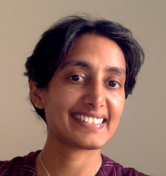

# Home {-}

```{r setup, include=FALSE}
library(msmbstyle)
# invalidate cache when the package version changes
knitr::opts_chunk$set(tidy = FALSE, cache.extra = packageVersion('msmbstyle'))
options(htmltools.dir.version = FALSE)
```

Welcome to the Triangle AI Book!  This book provides a broad introduction to artificial intelligence, dotted with musings on cognitive science, society, technology, and the human condition.

```{marginfigure}
This is **not** a book about machine learning,  neural networks, or data science, though some chapters do touch on those topics.  See [Other resources](#sec:resources) in the Introduction chapter for recommendations of other AI materials.
```

If you want to learn about the basic science of AI, and how we can use AI to understand and model various kinds of intelligences, then you will likely find something to enjoy in these pages.  

The material is similar to what is covered in a typical intro AI course in an undergraduate CS program, but with a few twists.  This book assumes familiarity with coding and algorithms, probability, and occasionally calculus.


## About me {-}

```{r, fig.margin = TRUE, echo = FALSE, out.width="50%", cache=TRUE}

```
```{marginfigure}
Pandemic self-haircut.
```

I am an assistant professor of computer science at Vanderbilt University.  I do research in AI and cognitive science, with a focus on visuospatial reasoning, human learning, and autism and other forms of neurodiversity.  My [research lab](https://my.vanderbilt.edu/aivaslab) is part of the School of Engineering at Vanderbilt University, and we are also affiliated with Vanderbilt's [Frist Center for Autism and Innovation](https://www.vanderbilt.edu/autismandinnovation/).

I belong to a research community within AI called *cognitive systems* (like other communities for computer vision, robotics, natural language processing, etc.).  The cognitive systems community is [small but active](http://www.cogsys.org/), and we tend to think about intelligence in terms of knowledge representations and reasoning processes---ideas that we will return to later on in this book.

My trajectory as an AI person began when I was a math major at MIT, where I worked on path planning research with [Nick Roy](https://groups.csail.mit.edu/rrg/index.php?n=Main.HomePage) and also took my first AI courses with [Patrick Winston](https://people.csail.mit.edu/phw/).  I then did a PhD in computer science at Georgia Tech, working on cognitive systems research with [Ashok Goel](http://dilab.gatech.edu/ashok-k-goel/), followed by a postdoc also at Georgia Tech with [Jim Rehg](https://rehg.org/), getting a bit into computer vision and machine learning.  I have been a CS faculty member at Vanderbilt since 2016.


## Acknowledgments {-}

This book incorporates perspectives about AI, cognitive science, and other things from many colleagues, including: [Ashok Goel](http://dilab.gatech.edu/ashok-k-goel/) and [Michael Helms](https://www.cc.gatech.edu/~mhelms3/) (cognitive science, cognitive systems, and knowledge-based AI); [Nancy Nersessian](https://www.cc.gatech.edu/aimosaic/faculty/nersessian/) (philosophy of science and cognition & culture); [Eric Schumacher](http://control.gatech.edu/people/eschumacher/) (cognitive neuroscience); [Rob Hampton](https://hamptonlab.wordpress.com/robert-hampton-2/) and [Joe Manns](http://psychology.emory.edu/home/people/faculty/manns-joseph.html) (comparative cognition); [Linda Smith](https://cogdev.sitehost.iu.edu/people.html), [Agata Rozga](http://www.agatarozga.org/), and [Rosa Arriaga](https://sites.google.com/view/riarriaga/home) (developmental psychology); [Jim Rehg](https://rehg.org/), [Fuxin Li](http://web.engr.oregonstate.edu/~lif/), and [David Crandall](https://homes.luddy.indiana.edu/djcran/) (computer vision and machine learning); and [Isabelle Soulières](https://professeurs.uqam.ca/professeur/Soulieres.Isabelle/), [Michelle Dawson](https://autismcrisis.blogspot.com/p/michelle-dawson.html), and [Laurent Mottron](http://www.cenum.umontreal.ca/membres/2_titulaires/en_mottron_l.html) (autism and neurodiversity).

```{r, fig.margin = TRUE, echo = FALSE, out.width="50%", cache=TRUE}

```
```{marginfigure}
[Patrick Henry Winston (1943-2019):](https://www.memoriesofpatrickwinston.com/remembrances) A teacher, mentor, and friend who captured my imagination long ago when he would pace around the front of the classroom and exclaim, "In AI, we are working to unlock the mysteries of the human mind!"
```

This book is also inspired by the memory and teachings of [Patrick Winston](https://people.csail.mit.edu/phw/), longtime professor and AI researcher at MIT.  Back in the day, I took his  [6.034](https://ocw.mit.edu/courses/electrical-engineering-and-computer-science/6-034-artificial-intelligence-fall-2010/lecture-videos/) intro AI course as well as his [6xxx](https://courses.csail.mit.edu/6.803/index.html) course on "The Human Intelligence Enterprise."  I also greatly enjoyed his vast store of wisdom about communication, much of which is collected in his final book [*Make It Clear*](https://mitpress.mit.edu/books/make-it-clear).

(Patrick's writings, like his lectures, are captivating.  Back in the spring of 2019, he sent me a publisher's proof of his book, which at the time was titled simply *Communication*.  As I was carrying it from my office to my car, I started idly flipping through the first few pages.  Before I knew it, I had stopped at a random bench and sat there for the next 2.5 hours finishing it!  Highly recommended.)  (Both the book, and reading it outside on a bench!)


## Open source contributors {-}

This book is being written as an open-source project.  Improvements and suggestions are welcomed via Github pull request: [View source](https://github.com/mkunda/triangleaibook).

Contributors are expected to abide by the Contributor-Covenant [Code of Conduct](https://www.contributor-covenant.org/version/2/1/code_of_conduct/).

[](https://github.com/mkunda/triangleaibook/blob/main/CODE_OF_CONDUCT.md)

## Authoring tools {-}

```{marginfigure}
I love Tufte-style marginalia!  We will have lots of these throughout this book.
```

```{marginfigure}
(If you don't know who Edward Tufte is, go locate a physical copy of [*The Visual Display of Quantitative Information*.](https://www.edwardtufte.com/tufte/books_vdqi)  Why a physical copy, you ask?  It is a gorgeous book.  Tufte self-published many of his books to be able to do what he wanted with the design, and it shows.  They really are works of art.)
```

This book was generated using the [bookdown](https://www.bookdown.org) authoring package for R, along with the [msmbstyle](https://github.com/grimbough/msmbstyle) and [tufte](https://github.com/rstudio/tufte) styling packages.  Particular tip-of-the-hat to Yihui Xie at RStudio for bookdown, tufte, and his [extensive how-to's](https://bookdown.org/yihui/bookdown/).

I learned many lessons about structure and format from other free online textbooks, including [*Neural Networks and Deep Learning*](http://neuralnetworksanddeeplearning.com/) by Michael Nielsen; [*Operating Systems: Three Easy Pieces*](https://pages.cs.wisc.edu/~remzi/OSTEP/) by Remzi Arpaci-Dusseau and Andrea Arpaci-Dusseau (and the accompanying [blog post](http://from-a-to-remzi.blogspot.com/2014/01/the-case-for-free-online-books-fobs.html) about open access textbooks); [*R for Data Science*](https://r4ds.had.co.nz/) by Hadley Wickham and Garrett Grolemund; and [*Modern Statistics for Modern Biology*](https://www.huber.embl.de/msmb/index.html) by Susan Holmes and Wolfgang Huber.

The font is [Lora](https://fonts.google.com/specimen/Lora), and the texture on the title bar is [White Diamond Dark](https://www.transparenttextures.com/white-diamond-dark.html).